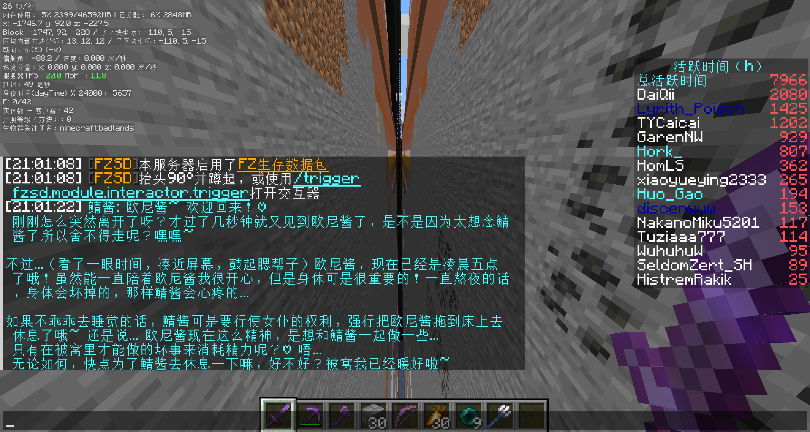
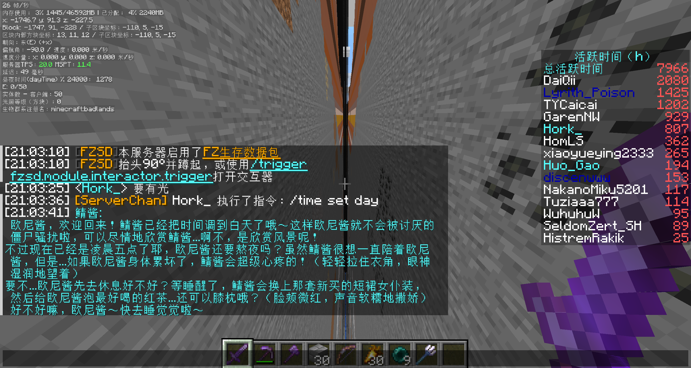

# ServerChan

[](https://github.com/himekifee/ServerChan/actions/workflows/server-test.yml)
[](https://www.gnu.org/licenses/gpl-3.0)
[](https://modrinth.com/mod/serverchan)
[](https://www.curseforge.com/minecraft/mc-mods/serverchan)
[](https://minecraft.net)
[](https://discord.gg/NuzHC7BCDc)

<p align="center">
  
</p>

**[English](README.md)** | [简体中文](README_CN.md) | [日本語](README_JA.md)

ServerChan is a friendly, AI-powered helper for Minecraft servers. It listens to chat, reacts to in-game events, and can even carry out commands when you give it permission. Whether you run a cozy SMP or a busy public server, ServerChan keeps conversations lively without spamming players.

## Features

- **AI Chat Integration** - Uses OpenAI-compatible APIs (OpenAI, Azure, local LLMs, etc.) to power intelligent conversations
- **Smart Response System** - Optional intention checker determines when the AI should respond, avoiding spam
- **Game Event Awareness** - Reacts to player joins/leaves, deaths, and other server events
- **Command Execution** - AI can execute Minecraft commands via function calling (with permission controls)
- **Multi-Loader Support** - Works on Fabric, Forge, NeoForge, and Spigot/Paper
- **Multi-Version Support** - Compatible with Minecraft 1.12 - 1.21
- **Fully Configurable** - Customize prompts, models, response behavior, and more
- **Internationalization** - Built-in i18n support (English, Chinese, Japanese)

## Demo

<p align="center">
  
</p>

<p align="center">
  
</p>

## Loader Compatibility Matrix

| Version | Java | Fabric | Forge | NeoForge | Spigot/Paper |
|---------|------|--------|-------|----------|--------------|
| 1.12.x  | 8    | —      | ❌    | —        | ✅           |
| 1.13.x  | 8    | —      | ❌    | —        | ✅           |
| 1.14.x  | 8    | ✅     | ❌    | —        | ✅           |
| 1.15.x  | 8    | ✅     | ❌    | —        | ✅           |
| 1.16.x  | 8    | ✅     | ✅    | —        | ✅           |
| 1.17.x  | 16   | ✅     | ✅    | —        | ✅           |
| 1.18.x  | 17   | ✅     | ✅    | —        | ✅           |
| 1.19.x  | 17   | ✅     | ✅    | —        | ✅           |
| 1.20.x  | 21   | ✅     | ✅    | ✅       | ✅           |
| 1.21.x  | 21   | ✅     | ✅    | ✅       | ✅           |

`—` means the loader didn't exist for that version (Fabric starts at 1.14, NeoForge at 1.20).

## Installation

You're just five steps away from a chatty server buddy:

1. Grab the jar that matches your loader from [Modrinth](https://modrinth.com/mod/serverchan) or [CurseForge](https://www.curseforge.com/minecraft/mc-mods/serverchan)
2. Drop it into the `mods/` folder (or `plugins/` for Spigot/Paper)
3. Launch the server once so the config file appears
4. Add your API key plus any tweaks you want (see [Configuration](#configuration))
5. Restart or `/reload` and start chatting

## Configuration

The config file lives at:
- **Fabric/Forge/NeoForge**: `config/serverchan.yaml`
- **Spigot**: `plugins/ServerChan/config.yml`

### Required Settings

| Option | Description |
|--------|-------------|
| `openaiApiKey` | Your OpenAI API key (or compatible provider) |
| `openaiBaseUrl` | API base URL (default: `https://api.openai.com/v1`) **Important: Must include `/v1` path** |

### Optional Settings

| Option | Default | Description |
|--------|---------|-------------|
| `model` | `gpt-5.1` | Model to use for responses |
| `temperature` | `1.0` | Response randomness (0.0 - 2.0) |
| `contextSize` | `20` | Number of messages to keep in context |
| `botColor` | `b` | Minecraft color code for bot chat |
| `timeZone` | `UTC` | Timezone for message timestamps |
| `locale` | `en` | Language for bot messages |

### Intention Checker Settings

The intention checker uses a smaller/faster model to decide if the AI should respond.

| Option | Default | Description |
|--------|---------|-------------|
| `useIntentionChecker` | `true` | Enable smart response filtering |
| `intentionCheckerModel` | `gpt-4o-mini` | Model for intention checking (personal rec: `qwen3-235b-a22b-2507` via Cerebras) |
| `responseProbabilityThreshold` | `0.5` | Minimum probability to trigger response |
| `useFastPathIntentionChecker` | `false` | Start response generation early |
| `intentionCheckerApiKey` | (empty) | Separate API key (uses main key if empty) |
| `intentionCheckerBaseUrl` | (empty) | Separate base URL (uses main URL if empty). **Must include `/v1` path if set** |

### Event Settings

| Option | Default | Description |
|--------|---------|-------------|
| `enableGameEvents` | `true` | React to game events |
| `enableJoinLeaveEvents` | `true` | React to player join/leave |
| `enableDeathEvents` | `true` | React to player deaths |

### Permission Settings

| Option | Default | Description |
|--------|---------|-------------|
| `inheritCmdSourcePermission` | `true` | AI inherits triggering player's permissions for commands |

### Custom Prompts

You can customize the system prompts to match the vibe of your server:
- `intentionCheckingSystemMessage` - Controls when AI decides to respond
- `responseGenerationSystemMessage` - Controls AI personality and behavior

### Example Prompts

Sample prompt files live in the `example/` folder to help you get started. For instance, `example/OnlyMyRedstone-system-prompt.txt` captures the full response-generation setup used on the OnlyMyRedstone community server, and `example/OnlyMyRedstone-intention-checking.txt` shows how that server throttles responses through intention checking. Feel free to duplicate and adapt these files for your own servers — they're meant to be remixed.

## Commands

All commands require operator permissions (level 4).

| Command | Description |
|---------|-------------|
| `/serverchan reload` | Reload configuration |
| `/serverchan reset` | Clear message context/memory |
| `/serverchan kill` | Reset the OpenAI client connection |
| `/serverchan disable` | Pause ServerChan responses (no messages processed) |
| `/serverchan enable` | Resume ServerChan responses |

## How It Works

1. **Player sends a message** in chat
2. **Intention Checker** (if enabled) evaluates if a response is appropriate
3. If response is needed, the **main model generates a reply**
4. The AI can optionally **execute commands** via function calling
5. Response is **broadcast to all players**

The AI maintains conversation context and can reference previous messages within the configured context size.

## Requirements

- Minecraft Server 1.12 - 1.21 (see [compatibility matrix](#loader-compatibility-matrix))
- One of: Fabric, Forge, NeoForge, or Spigot/Paper (availability varies by version)
- OpenAI API key (or compatible provider like Azure OpenAI, Ollama, etc.)

## Building from Source

```bash
# Clone the repository
git clone https://github.com/himekifee/ServerChan.git
cd ServerChan

# Build for a specific Minecraft version
./gradlew build -PmcVer=1.21

# Build merged jar (all loaders in one)
./gradlew build mergeJars -PmcVer=1.21
```

Built jars will be in `build/libs/` (or `build/forgix/` for merged jars).

### Development Testing

For local development, a test script is provided that builds the mod and spins up actual Minecraft servers to verify it loads correctly:

```bash
# Build and test on all platforms (requires Docker)
./dev-test.sh 1.21

# Build only, skip server tests
./dev-test.sh --build-only 1.21

# Test specific platform only
./dev-test.sh --fabric 1.21
./dev-test.sh --forge 1.21
./dev-test.sh --neoforge 1.21
./dev-test.sh --paper 1.21
```

The script requires Docker to run the server tests.

## Contributing

Contributions are welcome! Please feel free to submit issues and pull requests; we love hearing how you're using ServerChan.

1. Fork the repository
2. Create a feature branch (`git checkout -b feature/amazing-feature`)
3. Commit your changes (`git commit -m 'Add amazing feature'`)
4. Push to the branch (`git push origin feature/amazing-feature`)
5. Open a Pull Request

## Discord

Join our [Discord server](https://discord.gg/NuzHC7BCDc) to chat with the community, get help, or share your ServerChan setup!

## License

This project is licensed under the GNU General Public License v3.0 - see the [LICENSE](LICENSE) file for details.

## Acknowledgments

- Built on [Universal Mod Template](https://github.com/thebuildcraft/Universal-Mod-Template) by thebuildcraft
- Uses [ConfigLib](https://github.com/tomwmth/ConfigLib) for YAML configuration
- Uses [Architectury Loom](https://github.com/architectury/architectury-loom), [Forgix](https://github.com/PacifistMC/Forgix), and [Manifold](https://github.com/manifold-systems/manifold)

## Cerebras

Not sponsored by [Cerebras](https://cerebras.ai/), but I use their inference API for CI testing and my own server's intention checker model — it's blazingly fast! With a context of 20 messages, intention checking finishes within ~1 second, and full responses come back in about 2-5 seconds. That's basically instant compared to other LLM providers that often need 20+ seconds to reply, making Cerebras a perfect fit for real-time chat applications like this. If anyone from Cerebras is interested in sponsoring API credits or any other form of support, feel free to [open an issue](https://github.com/himekifee/ServerChan/issues/new) 😊
